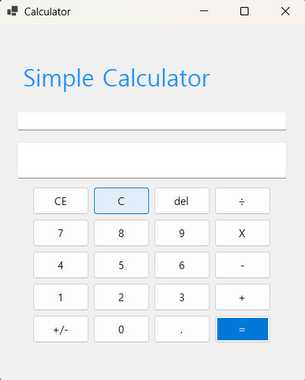
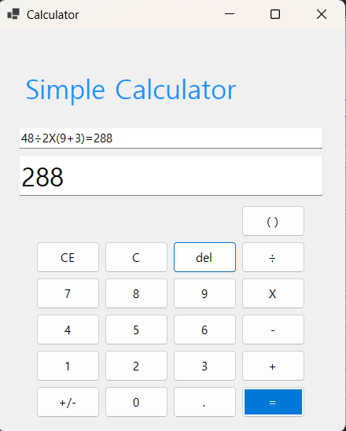

# (C# 코딩) 나만의 계산기
## 개요
- C# 프로그래밍 학습
- 핵심기능 : 숫자, 연산자 버튼을 누르면 텍스트박스에 해당 내용들이 입력됨, = 연산자를 누르면 만들어진 수식을 계산하고 표시함, C를 눌렀을 때 처음 상태로 초기화됨, CE를 눌렀을 때 마지막으로 입력한 피연산자가 삭제됨, del을 눌렀을 때 마지막 글자 하나만 삭제됨, del기능이 키보드의 백스페이스 키를 눌렀을 때에도 실행됨, 숫자와 연산자들도 키보드에서 각각의 키를 누르면 그에 맞는 숫자나 연산자를 입력함, 수식의 우선순위를 구현함, 괄호 기능을 추가하여 다양한 계산이 가능하도록 함
- 화면구성 : 숫자, 연산자, 기타 기능 버튼들 + 괄호 버튼 (총 20+1개), 입력 내용들을 보여주는 2개의 텍스트박스, Simple Calculator 가 입력된 라벨
## 실행 화면
- 1단계 코드의 실행 스크린샷

- 2단계 코드의 실행 스크린샷

- 3단계 코드의 실행 스크린샷

5X2 입력한 뒤 C버튼을 눌렀을 때의 화면

- 4단계 코드의 실행 스크린샷

키보드 입력으로도 숫자와 연산자의 입력이 가능하도록 기능 추가
수식의 우선순위 구현 및 괄호 기능 추가

## 배운 내용
- 입력된 값들을 문자열에서 숫자로 변환하고 계산하는 과정에서 어려움을 겪었지만, copilot의 도움을 받아 해결하였습니다.
- 입력된 내용 중 피연산자만을 표시하는 텍스트박스를 추가하는 과정에서 어려움을 겪었지만, copilot의 도움을 받아 해결하였습니다.
- C, CE, del 기능을 구현하는 과정에서 제대로 지워지지 않거나 텍스트박스의 내용이 남아있는 등의 문제를 겪었지만, copilot의 도움을 받아 해결하였습니다.
- 키보드를 눌렀을 때 해당 키와 같은 의미의 버튼이 눌린 것과 같은 기능을 추가하는 과정에서 어려움을 겪었지만. copilot의 도움을 받아 해결하였습니다.
- 수식의 우선순위를 구현하고 괄호 기능을 추가하는 과정에서 어려움을 겪었지만, copilot의 도움을 받아 해결하였습니다.
