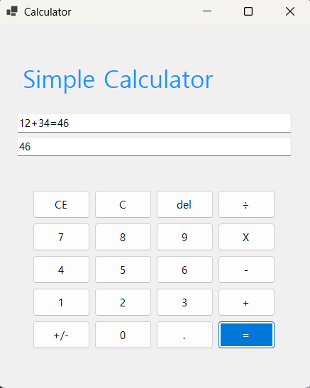
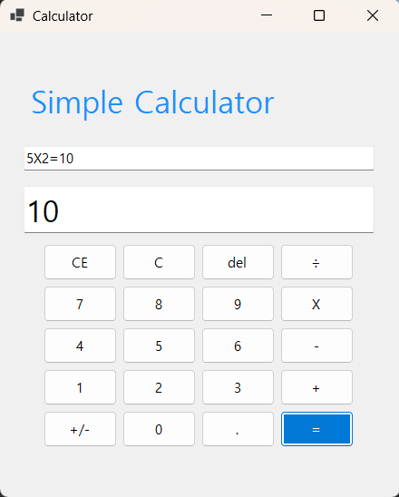

# (C# 코딩) 나만의 계산기
## 개요
- C# 프로그래밍 학습
- 핵심기능 : 숫자, 연산자 버튼을 누르면 텍스트박스에 해당 내용들이 입력됨, = 연산자를 누르면 만들어진 수식을 계산하고 표시함
- 화면구성 : 숫자, 연산자, 기타 기능 버튼들 (총 20개), 입력 내용들을 보여주는 2개의 텍스트박스, Simple Calculator 가 입력된 라벨
## 실행 화면
- 1단계 코드의 실행 스크린샷

- 2단계 코드의 실행 스크린샷

- 3단계 코드의 실행 스크린샷
(여기에 이미지 삽입)
- 4단계 코드의 실행 스크린샷
(여기에 이미지 삽입)
## 배운 내용
